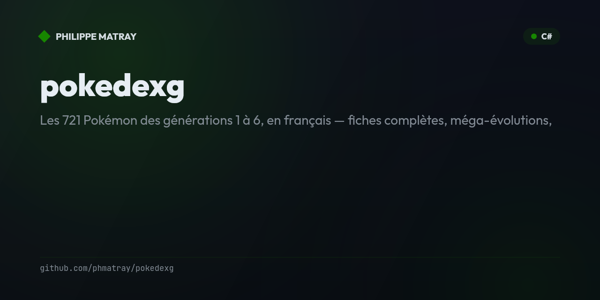

# Pokédex G

<!-- portfolio-badges:start -->
<!-- Identity -->
[](https://github.com/phmatray/pokedexg)

[](https://github.com/phmatray/pokedexg/stargazers)
[](https://github.com/phmatray/pokedexg/network/members)

<!-- Activity -->
[](https://github.com/phmatray/pokedexg/issues)
[](https://github.com/phmatray/pokedexg/pulls)
[](https://github.com/phmatray/pokedexg/commits)
<!-- portfolio-badges:end -->


> Les 721 Pokémon des générations 1 à 6, en français — fiches complètes, méga-évolutions,
> formes alternatives, table des types et capsules techniques. Consultable hors ligne (PWA).

## Architecture

| Projet | Rôle |
|---|---|
| `src/PokedexG.Core` | Modèles, filtrage et logique métier de 2016, portés verbatim (namespaces conservés) |
| `src/PokedexG.Data` | Façade `Veekun` + les 15 requêtes SQL de 2014 (verbatim, embarquées) sur `pokedex.sqlite` |
| `src/PokedexG.DataGen` | Générateur : exécute les requêtes au build → API statique JSON (`wwwroot/data/`) |
| `src/PokedexG.Web` | Blazor WebAssembly — 7 pages, thèmes « Rubis »/« Saphir », PWA hors ligne |
| `tests/PokedexG.Core.Tests` | 53 tests de caractérisation (requêtes, formats, filtre, couleurs) |
| `PokedexG.Uwp` | L'app UWP de 2016 — source des données (SQLite veekun 49 Mo) et des 2 713 assets |

Les données et les illustrations ne sont jamais dupliquées : le SQLite et les assets de 2016
sont lus/copiés octet pour octet au build.

## Développement

```bash
dotnet test PokedexG.Blazor.sln                 # 53 tests de caractérisation
dotnet run --project src/PokedexG.DataGen       # régénère l'API statique JSON
dotnet run --project src/PokedexG.Web           # sert l'app en local
cd src/PokedexG.Web && npm install && npm run css  # feuille Tailwind (committée)
```

La CI (`.github/workflows/ci.yml`) exécute les tests avec couverture ; le déploiement
(`deploy-pages.yml`) publie sur GitHub Pages avec un smoke test permanent (racine + fiche).

## Données & crédits

- Base de données : [veekun](https://veekun.com/) (schéma pokedex, contenu multilingue).
- Illustrations : Ken Sugimori & Global Link, collectées pour l'app de 2016.
- Pokédex G n'est pas affilié avec, sponsorisé, ou spécifiquement approuvé par Nintendo,
  Game Freak, Creatures et The Pokémon Company. Pokémon est une marque déposée de
  Nintendo Co., Ltd. Usage démonstratif et éducatif uniquement.

## Provenance

L'application d'origine (2016) est une app UWP distribuée par le Windows Store, conservée
dans `PokedexG.Uwp/`. Le rapport de modernisation — méthode, portes franchies, quirks figés,
preuves — est dans [`migration/report.md`](migration/report.md).

## License

MIT
